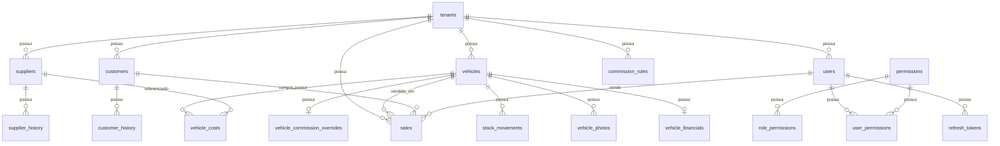

# WPS Car — Documentação do banco de dados

Documento de referência do modelo de dados PostgreSQL do projeto. A fonte da verdade é o schema Prisma em `apps/api/prisma/schema.prisma`.

| Item | Valor |
|------|--------|
| SGBD | PostgreSQL |
| ORM | Prisma |
| Estratégia multi-tenant | Banco e schema compartilhados; isolamento por `tenant_id` |
| Migrations | `apps/api/prisma/migrations/` |
| Seed | `apps/api/prisma/seed.ts` |

---

## Índice

1. [Visão geral](#visão-geral)
2. [Migrations aplicadas](#migrations-aplicadas)
3. [Diagrama de relacionamentos](#diagrama-de-relacionamentos)
4. [Enums](#enums)
5. [Tabelas](#tabelas)
6. [Regras de integridade](#regras-de-integridade)
7. [Dados de demonstração (seed)](#dados-de-demonstração-seed)
8. [Comandos úteis](#comandos-úteis)

---

## Visão geral

O WPS Car modela um **SaaS para revendas de veículos** (e produtos de estoque, como peças e acessórios). Cada **empresa** (`tenants`) possui usuários, veículos/produtos, clientes, fornecedores, vendas, comissões e configurações próprias.

### Princípios

- **Multi-tenant:** entidades de negócio incluem `tenant_id` e são filtradas na API por contexto da empresa logada.
- **Veículos e produtos:** mesma tabela `vehicles`; o tipo `PRODUCT` no enum `VehicleType` identifica produtos não veiculares.
- **Financeiro 1:1:** cada veículo tem no máximo um registro em `vehicle_financials` (valores de compra, venda, margens calculadas).
- **Auditoria:** várias tabelas possuem `created_at`, `updated_at`, `created_by_id`, `updated_by_id`.
- **Valores monetários:** `Decimal(14, 2)` no PostgreSQL.

### Usuário de plataforma

`users.tenant_id` é **opcional** apenas para `role = MODERATOR` (administração do SaaS, sem empresa).

---

## Migrations aplicadas

| Pasta | Descrição |
|-------|-----------|
| `20260519231905_init` | Criação inicial de todas as tabelas, enums e índices |
| `20260520120000_add_vehicle_type_product` | Adiciona valor `PRODUCT` ao enum `VehicleType` |

Verificar status:

```powershell
cd apps/api
npx prisma migrate status
```

---

## Diagrama de relacionamentos



---

## Enums

### Tenant e autenticação

| Enum | Valores |
|------|---------|
| `TenantStatus` | ACTIVE, INACTIVE, SUSPENDED, TRIAL |
| `SubscriptionPlan` | STARTER, PROFESSIONAL, ENTERPRISE |
| `UserRole` | MODERATOR, ADMIN, MANAGER, SELLER |

### Veículos e estoque

| Enum | Valores | Observação |
|------|---------|------------|
| `VehicleType` | CAR, MOTORCYCLE, TRUCK, UTILITY, **PRODUCT**, OTHER | PRODUCT = produto/peça |
| `VehicleStatus` | IN_STOCK, RESERVED, SOLD, IN_PREPARATION, IN_MAINTENANCE, UNAVAILABLE | |
| `FuelType` | GASOLINE, ETHANOL, FLEX, DIESEL, ELECTRIC, HYBRID, GNV, OTHER | |
| `TransmissionType` | MANUAL, AUTOMATIC, CVT, AUTOMATED_MANUAL, OTHER | |
| `VehicleCategory` | HATCH, SEDAN, SUV, PICKUP, VAN, COUPE, WAGON, OTHER | |
| `StockMovementType` | ENTRY, EXIT, ADJUSTMENT, RESERVATION, RELEASE | |

### Pessoas

| Enum | Valores |
|------|---------|
| `PersonType` | INDIVIDUAL, COMPANY |
| `SupplierCategory` | INDIVIDUAL, COMPANY, AUCTION, DEALERSHIP, INSURANCE, BANK, PRIVATE |
| `CustomerType` | BUYER, SELLER, BOTH |

### Financeiro, custos e vendas

| Enum | Valores |
|------|---------|
| `VehicleCostType` | PAINTING, MECHANICS, BODYWORK, SANITIZATION, DOCUMENTATION, TRANSPORT, REVISION, OTHER |
| `SaleStatus` | NEGOTIATION, SOLD, CANCELLED, AWAITING_PAYMENT, COMPLETED |
| `PaymentMethod` | CASH, BANK_TRANSFER, PIX, CREDIT_CARD, DEBIT_CARD, FINANCING, CHECK, TRADE_IN, OTHER |
| `CommissionRuleType` | SALE_PERCENTAGE, PROFIT_PERCENTAGE, FIXED_AMOUNT, CUSTOM_PER_VEHICLE |
| `OpportunityStatus` | OPEN, IN_PROGRESS, WON, LOST, CANCELLED |

### Anexos

| Enum | Valores |
|------|---------|
| `AttachmentEntityType` | VEHICLE, VEHICLE_COST, SALE, CUSTOMER, SUPPLIER |
| `AttachmentStorageProvider` | LOCAL, S3 |

---

## Tabelas

Convenção: nomes no PostgreSQL em **snake_case** (`@@map` no Prisma). PKs são `uuid` salvo indicação contrária.

### `tenants` — Empresas (revendas)

| Coluna | Tipo | Obrigatório | Descrição |
|--------|------|-------------|-----------|
| id | uuid | sim | PK |
| name | text | sim | Razão social / nome fantasia |
| cnpj | text | sim | CNPJ único no sistema |
| email | text | sim | E-mail de contato |
| phone | text | não | Telefone |
| status | TenantStatus | sim | Default TRIAL |
| plan | SubscriptionPlan | sim | Default STARTER |
| created_at | timestamp | sim | |
| updated_at | timestamp | sim | |

---

### `users` — Usuários

| Coluna | Tipo | Obrigatório | Descrição |
|--------|------|-------------|-----------|
| id | uuid | sim | PK |
| tenant_id | uuid | não | FK → tenants; **nulo** para MODERATOR |
| name | text | sim | |
| email | text | sim | Único por tenant |
| password_hash | text | sim | bcrypt |
| role | UserRole | sim | |
| active | boolean | sim | Default true |
| created_at, updated_at | timestamp | sim | |
| created_by_id, updated_by_id | uuid | não | FK → users |

**Índices:** `tenant_id`, `email`. **Unique:** `(tenant_id, email)`.

---

### `refresh_tokens` — Sessões / refresh JWT

| Coluna | Tipo | Descrição |
|--------|------|-----------|
| id | uuid | PK |
| tenant_id | uuid | FK → tenants (opcional) |
| user_id | uuid | FK → users |
| token_hash | text | Hash do refresh token |
| expires_at | timestamp | |
| revoked_at | timestamp | Logout / revogação |
| created_at | timestamp | |

---

### `permissions` — Catálogo de permissões (RBAC)

| Coluna | Tipo | Descrição |
|--------|------|-----------|
| id | uuid | PK |
| code | text | Único; ex.: `vehicles:create` |
| module | text | Módulo; ex.: `vehicles` |
| description | text | Texto legível |

---

### `role_permissions` — Permissões por perfil

| Coluna | Tipo | Descrição |
|--------|------|-----------|
| id | uuid | PK |
| role | UserRole | Perfil |
| permission_id | uuid | FK → permissions |

**Unique:** `(role, permission_id)`.

---

### `user_permissions` — Override por usuário

| Coluna | Tipo | Descrição |
|--------|------|-----------|
| id | uuid | PK |
| user_id | uuid | FK → users |
| permission_id | uuid | FK → permissions |
| granted | boolean | Default true |

**Unique:** `(user_id, permission_id)`.

---

### `vehicles` — Veículos e produtos

| Coluna | Tipo | Obrigatório | Descrição |
|--------|------|-------------|-----------|
| id | uuid | sim | PK |
| tenant_id | uuid | sim | FK → tenants |
| type | VehicleType | sim | CAR, PRODUCT, etc. |
| brand | text | sim | Marca / fabricante |
| model | text | sim | Modelo / nome do produto |
| version | text | não | Versão ou SKU |
| manufacture_year | int | sim | Ano fabricação / referência |
| model_year | int | sim | Ano modelo |
| license_plate | text | não | Placa (veículos) |
| renavam | text | não | |
| chassis | text | não | |
| color | text | não | |
| mileage | int | não | Quilometragem |
| fuel | FuelType | não | |
| transmission | TransmissionType | não | |
| doors | int | não | |
| category | VehicleCategory | não | |
| status | VehicleStatus | sim | Default IN_STOCK |
| notes | text | não | Observações |
| created_at, updated_at | timestamp | sim | |
| created_by_id, updated_by_id | uuid | não | FK → users |

**Unique:** `(tenant_id, license_plate)`, `(tenant_id, chassis)` (quando preenchidos).  
**Índices:** `(tenant_id, status)`, `(tenant_id, brand, model)`.

---

### `vehicle_photos` — Fotos do veículo/produto

| Coluna | Tipo | Descrição |
|--------|------|-----------|
| id | uuid | PK |
| tenant_id | uuid | |
| vehicle_id | uuid | FK → vehicles |
| file_name | text | Nome original |
| file_path | text | Caminho relativo (upload) |
| mime_type | text | |
| size_bytes | int | |
| sort_order | int | Ordem na galeria |
| is_primary | boolean | Foto principal |
| storage | AttachmentStorageProvider | LOCAL ou S3 |
| created_at | timestamp | |

---

### `vehicle_financials` — Dados financeiros (1:1 com vehicle)

| Coluna | Tipo | Descrição |
|--------|------|-----------|
| id | uuid | PK |
| tenant_id | uuid | |
| vehicle_id | uuid | FK → vehicles, **único** |
| purchase_value | decimal(14,2) | Valor de compra |
| purchase_date | timestamp | Data da compra |
| supplier_id | uuid | FK → suppliers (opcional) |
| fipe_value | decimal(14,2) | Valor FIPE |
| suggested_purchase_value | decimal(14,2) | Sugestão de compra |
| listed_value | decimal(14,2) | Valor anunciado |
| minimum_value | decimal(14,2) | Valor mínimo |
| sale_value | decimal(14,2) | Valor de venda |
| sale_date | timestamp | Data da venda |
| customer_id | uuid | FK → customers (comprador na venda) |
| seller_id | uuid | FK → users (vendedor) |
| total_costs | decimal(14,2) | Soma de custos (calculado) |
| commission_value | decimal(14,2) | Comissão (calculado) |
| gross_profit | decimal(14,2) | Lucro bruto |
| margin_amount | decimal(14,2) | Margem em R$ |
| margin_percent | decimal(8,4) | Margem % |
| net_result | decimal(14,2) | Resultado líquido |
| days_in_stock | int | Dias em estoque |
| calculated_at | timestamp | Último recálculo |
| created_at, updated_at | timestamp | |

---

### `vehicle_costs` — Custos por veículo

| Coluna | Tipo | Descrição |
|--------|------|-----------|
| id | uuid | PK |
| tenant_id | uuid | FK → tenants |
| vehicle_id | uuid | FK → vehicles |
| type | VehicleCostType | Tipo do custo |
| description | text | |
| amount | decimal(14,2) | |
| cost_date | timestamp | |
| supplier_id | uuid | FK → suppliers (opcional) |
| responsible_id | uuid | FK → users |
| created_at, updated_at | timestamp | |
| created_by_id, updated_by_id | uuid | |

---

### `stock_movements` — Movimentações de estoque

| Coluna | Tipo | Descrição |
|--------|------|-----------|
| id | uuid | PK |
| tenant_id | uuid | FK → tenants |
| vehicle_id | uuid | FK → vehicles |
| type | StockMovementType | ENTRY, EXIT, etc. |
| description | text | |
| reference | text | NF, contrato, etc. |
| user_id | uuid | FK → users |
| created_at | timestamp | |

Na criação de um veículo, a API registra automaticamente uma movimentação **ENTRY** (“Entrada inicial no estoque”).

---

### `customers` — Clientes

| Coluna | Tipo | Descrição |
|--------|------|-----------|
| id | uuid | PK |
| tenant_id | uuid | FK → tenants |
| name | text | |
| document | text | CPF ou CNPJ |
| phone, email | text | |
| street, number, complement, neighborhood, city, state, zip_code | text | Endereço |
| person_type | PersonType | PF ou PJ |
| customer_type | CustomerType | BUYER, SELLER, BOTH |
| notes | text | |
| assigned_seller_id | uuid | FK → users |
| active | boolean | |
| created_at, updated_at, created_by_id, updated_by_id | | |

**Unique:** `(tenant_id, document)`.

---

### `customer_history` — Histórico do cliente

| Coluna | Tipo | Descrição |
|--------|------|-----------|
| id | uuid | PK |
| tenant_id | uuid | |
| customer_id | uuid | FK → customers |
| action | text | Ex.: CREATED, SALE, NOTE |
| details | jsonb | Payload variável |
| user_id | uuid | |
| created_at | timestamp | |

---

### `suppliers` — Fornecedores

| Coluna | Tipo | Descrição |
|--------|------|-----------|
| id | uuid | PK |
| tenant_id | uuid | FK → tenants |
| name, document | text | |
| phone, email | text | |
| Endereço | text | Mesma estrutura de customer |
| person_type | PersonType | |
| category | SupplierCategory | Leilão, revenda, etc. |
| notes, active | | |
| Auditoria | timestamp / uuid | |

**Unique:** `(tenant_id, document)`.

---

### `supplier_history` — Histórico do fornecedor

Estrutura análoga a `customer_history`.

---

### `sales` — Vendas
 
|--------|------|-----------|
| id | uuid | PK |
| tenant_id | uuid | FK → tenants |
| vehicle_id | uuid | FK → vehicles |
| customer_id | uuid | FK → customers |
| seller_id | uuid | FK → users |
| amount | decimal(14,2) | Valor da venda |
| payment_method | PaymentMethod | |
| sale_date | timestamp | |
| status | SaleStatus | Default NEGOTIATION |
| commission | decimal(14,2) | |
| notes | text | |
| Auditoria | | |

---

### `opportunities` — Oportunidades (pipeline)

| Coluna | Tipo | Descrição |
|--------|------|-----------|
| id | uuid | PK |
| tenant_id | uuid | |
| vehicle_id | uuid | Opcional |
| customer_id | uuid | |
| seller_id | uuid | |
| title | text | |
| amount | decimal(14,2) | |
| status | OpportunityStatus | |
| notes | text | |

---

### `commission_rules` — Regras de comissão

| Coluna | Tipo | Descrição |
|--------|------|-----------|
| id | uuid | PK |
| tenant_id | uuid | |
| name | text | |
| type | CommissionRuleType | |
| value | decimal(14,4) | % ou valor fixo |
| active | boolean | |
| is_default | boolean | Regra padrão do tenant |

---

### `vehicle_commission_overrides` — Comissão específica por veículo

| Coluna | Tipo | Descrição |
|--------|------|-----------|
| id | uuid | PK |
| tenant_id | uuid | |
| vehicle_id | uuid | FK → vehicles |
| type | CommissionRuleType | |
| value | decimal(14,4) | |

**Unique:** `(tenant_id, vehicle_id)`.

---

### Configurações do tenant

| Tabela | Descrição |
|--------|-----------|
| `tenant_settings` | Pares `key` + `value` (JSON); ex.: margens padrão |
| `config_vehicle_types` | Tipos de veículo customizáveis (UI) |
| `config_cost_types` | Tipos de custo customizáveis |
| `config_payment_methods` | Formas de pagamento |
| `config_statuses` | Status custom por entidade (`entity` + `code`) |
| `config_email_templates` | Templates de e-mail (`code`, `subject`, `body_html`) |

Todas com `tenant_id` e **unique** em `(tenant_id, code)` ou equivalente.

---

### `attachments` — Anexos genéricos

| Coluna | Tipo | Descrição |
|--------|------|-----------|
| id | uuid | PK |
| tenant_id | uuid | |
| entity_type | AttachmentEntityType | VEHICLE, SALE, etc. |
| entity_id | uuid | ID da entidade (sem FK rígida) |
| file_name, file_path, mime_type, size_bytes | | |
| storage | AttachmentStorageProvider | |
| created_at | timestamp | |

---

### `purchase_intelligence_queries` — Histórico compra inteligente (FIPE/placa)

| Coluna | Tipo | Descrição |
|--------|------|-----------|
| id | uuid | PK |
| tenant_id | uuid | |
| license_plate | text | Placa consultada |
| fipe_value | decimal(14,2) | |
| desired_margin_percent | decimal(8,4) | |
| estimated_costs | decimal(14,2) | |
| max_purchase_value | decimal(14,2) | |
| raw_response | jsonb | Resposta bruta da consulta |
| user_id | uuid | |
| created_at | timestamp | |

---

## Regras de integridade

| Regra | Detalhe |
|-------|---------|
| Isolamento | Dados de negócio sempre vinculados a `tenant_id` |
| Placa | Única por empresa quando informada |
| Chassi | Único por empresa quando informado |
| CPF/CNPJ cliente e fornecedor | Único por empresa |
| Veículo vendido | `sales.vehicle_id` com `onDelete: Restrict` |
| Exclusão em cascata | Tenant removido → remove dados dependentes (users, vehicles, etc.) |
| Financeiro | Um `vehicle_financials` por `vehicle_id` |

---

## Dados de demonstração (seed)

Executar:

```powershell
cd apps/api
npx prisma db seed
```

### Empresa demo

| Campo | Valor |
|-------|--------|
| Nome | Revenda Demo WPS |
| CNPJ | 00000000000191 |
| Status | ACTIVE |
| Plano | PROFESSIONAL |

### Usuários (login com CNPJ da empresa no front)

| Perfil | E-mail | Senha |
|--------|--------|-------|
| Admin | admin@revendademo.com.br | Admin@123 |
| Gerente | gerente@revendademo.com.br | Manager@123 |
| Vendedor | vendedor@revendademo.com.br | Seller@123 |
| Moderador (plataforma) | moderator@wpscar.com.br | Moderator@123 |

O seed também cria permissões, configurações padrão do tenant e regra de comissão padrão (2% sobre venda).

---

## Comandos úteis

```powershell
cd apps/api

# Abrir interface visual do banco
npx prisma studio

# Gerar client após alterar schema
npx prisma generate

# Criar migration após editar schema.prisma
npx prisma migrate dev --name descricao_da_mudanca

# Aplicar migrations em produção/CI
npx prisma migrate deploy

# Reset completo (apaga dados — cuidado)
npx prisma migrate reset
```

Variável de ambiente: `DATABASE_URL` em `apps/api/.env` (ver `.env.example` na raiz).

---

## Documentação relacionada

- [ARCHITECTURE.md](./ARCHITECTURE.md) — multi-tenant e camadas da API
- [API-VEHICLES-STOCK.md](./API-VEHICLES-STOCK.md) — endpoints de veículos e estoque
- [SETUP-POSTGRES-WINDOWS.md](./SETUP-POSTGRES-WINDOWS.md) — instalação do PostgreSQL

---

*Última revisão alinhada ao schema Prisma do repositório WPS Car.*
