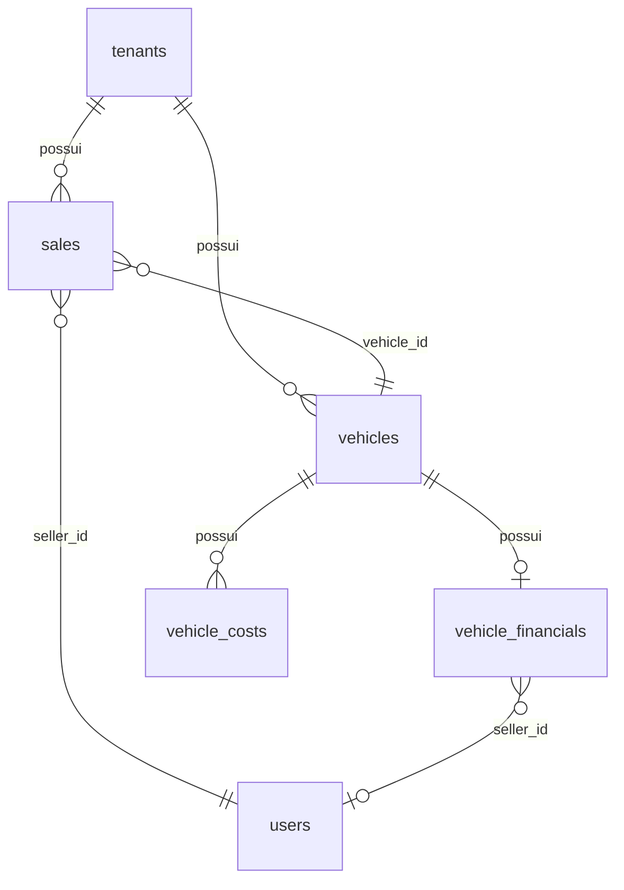

# Relatório geral da empresa — Documentação funcional

Documento do módulo **Relatórios → Relatório geral**, visão consolidada da revenda (tenant) por período e filtros.

Documentação relacionada:
- [API — Relatórios](./API-REPORTS.md)
- [Resultado financeiro por veículo](./FINANCIAL-RESULT.md)
- [API — Vendas & Comissões](./API-SALES-COMMISSIONS.md)
- [Banco de dados — Vendas e financeiro](./DATABASE.md)

---

## Objetivo

Permitir que **Administrador** e **Gerente** visualizem indicadores financeiros agregados da revenda em um período, com filtros opcionais (vendedor, tipo de veículo, status da venda), para apoiar decisão gerencial.

O relatório **não substitui** o resultado individual por veículo (aba Financeiro → Resultado); ele **soma** operações que entraram no recorte filtrado.

---

## Onde aparece no sistema

| Local | Rota | Quem acessa |
|-------|------|-------------|
| Menu lateral → Relatórios → Relatório geral | `/relatorios/geral` | `ADMIN`, `MANAGER` com permissão `reports:read` |
| Hub de relatórios | `/relatorios` | Card “Relatório geral” |

**Vendedor (`SELLER`):** não acessa este relatório (usa Relatório de comissão, apenas o próprio).

---

## Permissões e API

| Item | Valor |
|------|--------|
| Permissão | `reports:read` |
| Papéis | `ADMIN`, `MANAGER` |
| Endpoint | `GET /api/v1/reports/general` |
| Query | `startDate`, `endDate`, `vehicleType`, `sellerId`, `status` (todos opcionais) |

Resposta JSON (exemplo):

```json
{
  "salesCount": 12,
  "totalRevenue": "620000.00",
  "totalAcquisitionCost": "480000.00",
  "totalOperationalCosts": "35000.00",
  "grossProfit": "105000.00",
  "grossMarginPercent": "16.94",
  "totalCommission": "18600.00",
  "estimatedNetResult": "86400.00"
}
```

---

## Banco de dados (tabelas envolvidas)

O relatório **lê** dados já persistidos; não grava tabela própria de relatório.



### Tabela `sales` (fonte principal)

| Coluna | Uso no relatório |
|--------|------------------|
| `tenant_id` | Isolamento multi-tenant |
| `vehicle_id` | Liga ao veículo e ficha financeira |
| `seller_id` | Filtro e agregação por vendedor |
| `amount` | **Receita total** (soma) |
| `sale_date` | Filtro de **período** |
| `status` | Filtro de status (opcional) |
| `commission` | **Comissão total** (prioridade; snapshot em vendas finalizadas) |

Índices relevantes: `(tenant_id, sale_date)`, `(tenant_id, seller_id)`, `(tenant_id, status)`.

### Tabela `vehicle_financials` (fonte complementar + custos/compra)

| Coluna | Uso no relatório |
|--------|------------------|
| `vehicle_id` | 1:1 com veículo |
| `purchase_value` | **Custo total de aquisição** (soma) |
| `total_costs` | **Custos operacionais vinculados** (soma; já agrega `vehicle_costs`) |
| `sale_value`, `sale_date` | Vendas informadas **só na ficha financeira** (sem linha em `sales`) |
| `seller_id` | Filtro por vendedor nesse caso |
| `commission_value` | Comissão quando não há `sales.commission` |

### Tabela `vehicles`

| Coluna | Uso no relatório |
|--------|------------------|
| `type` | Filtro **Tipo de veículo** (`VehicleType`) |

### Tabela `vehicle_costs`

Não é somada diretamente no relatório; entra via `vehicle_financials.total_costs` (recalculado pelo domínio financeiro).

### Tabelas não utilizadas (hoje)

| Conceito | Situação |
|----------|----------|
| **Loja / unidade** | Não existe no schema; filtro previsto para versão futura |
| Despesas fixas da revenda (aluguel, folha administrativa) | Fora do escopo; por isso o líquido é **estimado** |

Detalhes das colunas: [DATABASE.md](./DATABASE.md) (`sales`, `vehicle_financials`, `vehicle_costs`).

---

## Estrutura de funcionamento

### Visão geral

```
[Filtros na tela]
       ↓
GET /reports/general
       ↓
1) Buscar vendas (sales) no tenant + filtros
2) Para cada venda: somar amount, compra, custos, comissão (via vehicle_financials)
3) Se NÃO houver filtro de status: buscar fichas financeiras com venda
   (sale_value + sale_date) sem registro duplicado em sales
4) Calcular indicadores agregados
       ↓
[Cards na UI]
```

### Duas origens de “venda” no relatório

| Origem | Quando entra | Evita duplicidade |
|--------|--------------|-------------------|
| **A — Registro em `sales`** | Sempre que a venda passa nos filtros | — |
| **B — Só ficha financeira** | `sale_value` > 0, `sale_date` no período, **sem** filtro de `status` | Veículo já contado em A é ignorado |

Recomendação operacional: registrar vendas também em **Vendas** para histórico, comissão congelada e relatório de comissão alinhado.

### Filtros

| Filtro | Campo / tabela | Comportamento |
|--------|----------------|---------------|
| **Período** | `sales.sale_date` ou `vehicle_financials.sale_date` | Início e fim do dia (UTC na API). Padrão na tela: mês atual |
| **Vendedor** | `sales.seller_id` ou `vehicle_financials.seller_id` | Vazio = todos |
| **Tipo de veículo** | `vehicles.type` | Vazio = todos |
| **Status da venda** | `sales.status` | Vazio = todos os status em `sales` + origem B (ficha). Com status definido: **apenas** `sales` |
| **Loja/unidade** | — | Não implementado |

### Indicadores e fórmulas (agregado)

Para cada operação incluída no recorte, o sistema acumula valores e depois aplica:

| Indicador na tela | Campo API | Fórmula |
|-------------------|-----------|---------|
| Receita total | `totalRevenue` | Σ valor de venda |
| Custo total de aquisição | `totalAcquisitionCost` | Σ `purchase_value` |
| Custos operacionais vinculados | `totalOperationalCosts` | Σ `total_costs` |
| Lucro bruto | `grossProfit` | Receita − Aquisição − Custos operacionais |
| Margem bruta | `grossMarginPercent` | (Lucro bruto ÷ Receita) × 100 |
| Comissão total | `totalCommission` | Σ comissão (`sales.commission` ou `commission_value`) |
| Resultado líquido estimado | `estimatedNetResult` | Lucro bruto − Comissão total |

Contador **“X venda(s) no período”** = `salesCount` (número de operações somadas, A + B).

Alinhamento com [FINANCIAL-RESULT.md](./FINANCIAL-RESULT.md): mesmas fórmulas por veículo, aplicadas em nível de **soma** no período.

**Precisão:** valores monetários e percentuais com **duas casas decimais**.

### Comissão no agregado

- Venda em `sales` com `commission` preenchida → usa snapshot (regra de congelamento em vendas finalizadas).
- Caso contrário → `vehicle_financials.commission_value`.
- Alteração posterior da regra do vendedor **não** altera comissão de vendas já finalizadas (ver FINANCIAL-RESULT, regras 16–18).

### Limitações importantes

1. **Período:** venda fora do intervalo (ex.: 28/05 com filtro “mês” em junho) **não aparece**.
2. **Custos e compra:** valores atuais da ficha financeira, não histórico “congelado” na data da venda.
3. **Status em branco:** entram negociações, canceladas, etc. em `sales`; para visão “só fechadas”, filtrar **Vendido** / **Finalizado**.
4. **Resultado líquido estimado:** não inclui despesas gerais da loja fora dos veículos vendidos no recorte.

---

## Regras de negócio

### Acesso e escopo

1. O relatório geral é da **revenda (tenant)**; dados de outras empresas nunca são misturados.
2. Apenas usuários com papel **Administrador** ou **Gerente** e permissão `reports:read` podem acessar.
3. O vendedor utiliza o **Relatório de comissão**, restrito ao próprio desempenho.

### Fontes de dados

4. O relatório deve considerar, no mínimo, todos os registros de **`sales`** que atendam aos filtros.
5. Quando **não** houver filtro de status, o sistema deve incluir também veículos com venda informada apenas em **`vehicle_financials`** (`sale_value` e `sale_date` no período), sem duplicar veículo já contado via `sales`.
6. Com **filtro de status** informado, apenas registros de **`sales`** com aquele status entram no cálculo.

### Filtros

7. O filtro de **período** deve usar a **data da venda** (`sale_date`), não a data de cadastro do veículo.
8. O filtro de **vendedor** deve restringir por `seller_id` em `sales` ou em `vehicle_financials` (origem B).
9. O filtro de **tipo de veículo** deve restringir pelo tipo do veículo vinculado (`vehicles.type`).
10. O filtro **Loja/unidade** ficará disponível quando o cadastro multi-loja existir no produto.

### Indicadores

11. A **receita total** é a soma dos valores de venda das operações incluídas.
12. O **custo total de aquisição** é a soma dos valores de compra (`purchase_value`) das fichas financeiras dessas operações.
13. Os **custos operacionais vinculados** são a soma de `total_costs` das fichas (custos lançados em `vehicle_costs` e recalculados no financeiro).
14. O **lucro bruto** agregado deve seguir:

    **Lucro bruto = Receita total − Custo de aquisição − Custos operacionais**

15. A **margem bruta (%)** deve seguir:

    **Margem bruta = (Lucro bruto ÷ Receita total) × 100** (se receita > 0)

16. A **comissão total** é a soma das comissões das operações, respeitando comissão congelada em `sales` quando existir.
17. O **resultado líquido estimado** deve seguir:

    **Resultado líquido estimado = Lucro bruto − Comissão total**

18. Valores monetários e percentuais devem ser exibidos com **duas casas decimais**.
19. O sistema deve recalcular os indicadores automaticamente ao alterar qualquer filtro na tela (sem ação manual de “atualizar” além da troca de filtro).

### Atualização dos números

20. Alterações em custos, compra ou comissão (conforme regras de [FINANCIAL-RESULT.md](./FINANCIAL-RESULT.md)) refletem no relatório na **próxima consulta**, pois os valores vêm do estado atual do banco.
21. O relatório geral **não persiste** snapshot próprio; é sempre calculado em tempo real.

---

## Critérios de aceite

### Cenário 1: Visualização dos indicadores

**Dado** que o usuário seja Administrador ou Gerente com permissão de relatórios  
**Quando** acessar **Relatórios → Relatório geral**  
**Então** o sistema deve exibir os indicadores: receita total, custo de aquisição, custos operacionais, lucro bruto, margem bruta, comissão total e resultado líquido estimado  
**E** a quantidade de operações no período.

---

### Cenário 2: Filtro por período

**Dado** que existam vendas em meses diferentes  
**Quando** o usuário selecionar o período (dia, mês, ano ou de-até)  
**Então** apenas operações com data de venda dentro do intervalo devem compor os totais  
**E** a descrição do período na tela deve refletir as datas corretas (sem deslocamento confuso por fuso).

---

### Cenário 3: Filtro por vendedor

**Dado** que existam vendas de mais de um vendedor  
**Quando** o usuário selecionar um vendedor específico  
**Então** os indicadores devem considerar somente as operações daquele vendedor.

---

### Cenário 4: Filtro por tipo de veículo

**Dado** que existam vendas de tipos diferentes (ex.: carro e produto)  
**Quando** o usuário filtrar por um tipo  
**Então** os indicadores devem considerar apenas veículos/produtos daquele tipo.

---

### Cenário 5: Filtro por status

**Dado** que existam vendas em vários status  
**Quando** o usuário selecionar um status (ex.: Finalizado)  
**Então** apenas vendas com esse status em `sales` devem entrar no cálculo  
**E** vendas informadas somente na ficha financeira não devem entrar nesse recorte.

---

### Cenário 6: Venda só na ficha financeira

**Dado** que um veículo tenha valor e data de venda na ficha financeira, sem registro em `sales`  
**E** que não haja filtro de status  
**Quando** o gerente abrir o relatório geral no período da venda  
**Então** essa operação deve ser contabilizada nos indicadores  
**E** não deve haver duplicidade se depois existir registro em `sales` para o mesmo veículo no mesmo recorte.

---

### Cenário 7: Período sem operações

**Dado** que não existam operações no período/filtros selecionados  
**Quando** o relatório for carregado  
**Então** os indicadores monetários devem ser zero ou traço (margem %)  
**E** o contador de vendas deve ser zero.

---

### Cenário 8: Acesso negado ao vendedor

**Dado** que o usuário seja **Vendedor**  
**Quando** tentar acessar o relatório geral  
**Então** o item não deve aparecer no menu (ou o acesso à API deve ser negado).

---

### Cenário 9: Comissão congelada em venda finalizada

**Dado** uma venda finalizada com comissão gravada em `sales.commission`  
**Quando** a regra de comissão do vendedor for alterada depois  
**Então** o relatório geral no período da venda deve manter a comissão original da venda.

---

## Implementação (referência técnica)

| Camada | Arquivo / componente |
|--------|----------------------|
| API | `apps/api/src/modules/reports/reports.controller.ts` → `GET general` |
| Serviço | `apps/api/src/modules/reports/reports.service.ts` |
| Agregação | `apps/api/src/modules/reports/reports.repository.ts` → `getGeneralReport` |
| DTO query | `apps/api/src/modules/reports/dto/general-report-query.dto.ts` |
| Tela | `apps/web/src/app/(app)/relatorios/geral/page.tsx` |
| Cliente HTTP | `apps/web/src/lib/api.ts` → `getGeneralReport` |
| Menu | `apps/web/src/components/layout/nav-relatorios.tsx` |

---

## Evoluções previstas

- Filtro **Loja/unidade** quando o modelo multi-filial existir.
- Exportação PDF/XLSX do relatório geral (hoje só JSON na tela).
- Opção de preset “Somente vendas finalizadas” no filtro de status.
